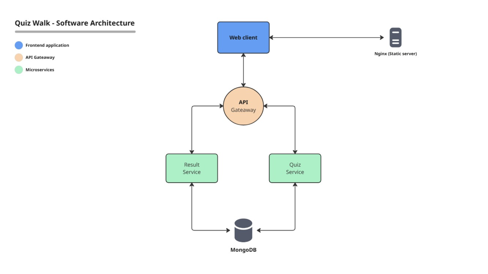

# Quiz-Walk Application: System Documentation

---

## 1. Description of the Software

The **Quiz-Walk application** is a microservice-based web platform that allows users to:

- Create new quizzes with multiple questions and answers.  
- Participate in quizzes by submitting answers under a chosen username.  
- View their results and compare them with others on a leaderboard.  

### System Components
- **Frontend:** Vue.js + Vuetify served by Nginx.  
- **Backend Services:** Node.js (Express), each with its own responsibility.  
- **Database:** MongoDB for persistent storage of quizzes and results.  
- **Deployment:** Kubernetes files to orchestrate and run the services in a scalable, cloud-native environment.  
 
---

## 2. Software Architecture Design

### High-Level Architecture
- The system follows a **microservices architecture** with an **API Gateway pattern** for centralized entry.  
- All services are **containerized** and deployed in **Kubernetes**, communicating via **internal cluster networking**.  

Here’s an overview of the system:

---

### Components & Responsibilities

#### Frontend (Vue + Vuetify + Nginx)
- **Role:** Provides the user interface.  
- **Responsibilities:**
  - Hosts the compiled Vue.js application using Nginx.
  - Allows quiz creation, participation, and viewing results.
  - Nginx delivers static files (HTML, JS, CSS) to clients.

#### API Gateway (Express)
- **Role:** Single entry point for frontend.  
- **Responsibilities:**  
  - Routes requests to `quiz-service` or `result-service`.  
  - Simplifies API access for frontend.
  - Provides a place for middleware (auth, rate limiting, logging).

#### Quiz Service (Express + Mongoose)
- **Role:** Manages quizzes.  
- **Responsibilities:**  
  - CRUD operations for quizzes.    
  - Validation of inputs using Zod.    

#### Result Service (Express + Mongoose)
- **Role:** Manages quiz submissions and leaderboards.  
- **Responsibilities:**  
  - Accepts quiz answers.  
  - Computes scores.  
  - Stores submissions in MongoDB.  
  - Provides leaderboard 

#### MongoDB
- **Role:** Persistent data store.  
- **Responsibilities:**  
  - Stores quizzes.  
  - Stores quiz results and user submissions.  
- **Pattern:** Shared Database per Service (currently both quiz and result services share the same DB instance).
- **Deployment:** Uses StatefulSet with PVC for storage durability.

#### Kubernetes Orchestration
- **Role:** Manages deployment and scaling.  
- **Responsibilities:**  
  - Ensures each microservice runs as a Deployment (except MongoDB, which runs as a StatefulSet).  
  - Provides internal service discovery via ClusterIP.  
  - Exposes API Gateway and Frontend externally via LoadBalancer.
  - Ensures MongoDB persistence using PersistentVolumeClaims. 

---

### Mapping Between Components & Microservices
- **Frontend (Vue app)** → `frontend` Deployment + LoadBalancer Service.  
- **API Gateway** → `api-gateway` Deployment + LoadBalancer Service.  
- **Quiz Service** → `quiz-service` Deployment + ClusterIP Service.  
- **Result Service** → `result-service` Deployment + ClusterIP Service.  
- **Database** → `mongo` StatefulSet + Headless Service + PVC.  

---

## 3. Benefits and Challenges

### Benefits

**Separation of Concerns**  
- Each service has a clear responsibility (quizzes vs results).  
- Easier to maintain, extend, and debug.  

**Scalability**  
- Independent scaling of services.  
- Kubernetes handles replication and load balancing.  

**Resilience**  
- If one service fails, others remain functional (e.g., quizzes can still be browsed even if results service is down).
- MongoDB is deployed as a StatefulSet, which provides stable identity and durable storage.

**Cloud-Native Deployment**  
- Kubernetes ensures self-healing, rolling updates, and portability across environments.
- The API Gateway centralizes routing and simplifies client integration.

---

### Challenges

**Security**  
- MongoDB credentials (`root/example`) are stored as plaintext in deployments.  
- Communication between services is not encrypted (HTTP instead of HTTPS).  
- No authentication/authorization for quiz creation or submissions.
- **Critical vulnerability:** the /submissions/:quizid/answers endpoint exposes all correct answers. Without protection, this represents a data leakage vulnerability, as anyone could fetch the answers directly and bypass the quiz.

**Mitigation done:**
- Added an API Gateway as the single entry point, enabling middleware for request validation and the possibility of future authentication.
- Scoped MongoDB credentials to only internal services within the Kubernetes cluster (not exposed externally).
- Exposed only the frontend and API Gateway via LoadBalancer, minimizing the attack surface.

**Mitigations:**  
- Use Kubernetes Secrets for sensitive credentials.  
- Enable TLS for inter-service communication.  
- Add authentication (JWT-based or OAuth2) to API Gateway to protect endpoints.
- Restrict access to /submissions/:quizid/answers with authorization (only quiz creators/admins can access).

**Database Coupling**  
- Quiz service and result service share the same MongoDB instance.  
- Creates coupling and a single point of failure.
  
**Mitigation done:**
- They use separate collections and clear schema separation, so queries remain isolated.

**Mitigations:**  
- Move towards separate databases per service.  
